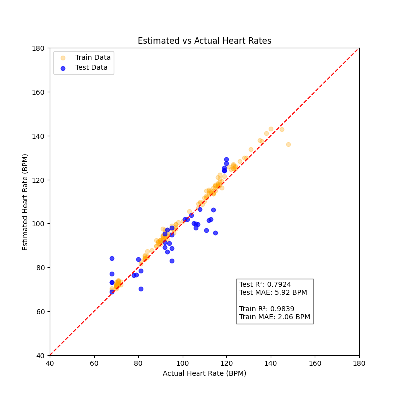

# Contactless Heart Rate Estimation from 60 GHz FMCW Radar Using a 1D CNN

This project demonstrates how to estimate heart rate using a 60 GHz FMCW radar and a lightweight 1D CNN regression model.

## Project Overview

This project explores contactless physiological monitoring using mm-wave radar. Specifically, the network created here estimates heart rate given a window of the unwrapped phase angle of a radar return signal. This input window is the result of preprocessing using classical application-agnostic DSP, and is the format of the radar data contained in this repository.

## Setup Instructions

### 1. Clone the repository

    git clone https://github.com/jessejc-UW/596_Final_Project_JesseCastleberry.git
    cd 596_Final_Project_JesseCastleberry

### 2. Create a Python environment (recommended)

    python3 -m venv venv
    source venv/bin/activate

### 3. Install dependencies

    pip install -r requirements.txt

## How to Run the Demo

### Run:

    python demo/demo.py

### The script will:

- Download the pre-trained model and data to be used in the demo
- Load the pre-trained model (`demo/tmp/heart_rate_estimator.pth`)
- De-trend and normalize the input data
- Run inference
- Save outputs to `demo/results/`

## Expected Output

Example terminal output:

    Test R^2: 0.7924
    Test MAE: 5.9182 BPM
    Train R^2: 0.9839
    Train MAE: 2.0643 BPM

Generated files:

    demo/results/
        performance.png

## Pre-trained Model

The demo script will automatically download the pre-trained model. The checkpoint used in the demo script is downloaded directly from this repository, here:

[heart_rate_estimator.pth](https://raw.githubusercontent.com/jessejc-UW/596_Final_Project_JesseCastleberry/main/checkpoints/20251211-191633/heart_rate_estimator.pth)

## Reproducibility

To retrain:

    python src/main.py

Hyperparameters: 

- Optimizer: `Adam`
  - LR: 5e-5
  - Weight Decay: 3e-4
- Batch size: 32
- Epochs: 1000 (maximum, early-stopping will typically end the training run much sooner than this.)
- Loss: `SmoothL1Loss()`

## Acknowledgments

This work draws on foundational concepts in radar systems and signal processing as presented in:

- M. I. Skolnik (Ed.), *Radar Handbook*, 3rd ed., McGraw–Hill, 2008.

Additional tools and resources used in this project include:

- PyTorch for neural network training and inference  
- NumPy and SciPy for numerical computation and signal processing  
- Matplotlib for data visualization  

## License

Released under the GNU GPLv3 License.
